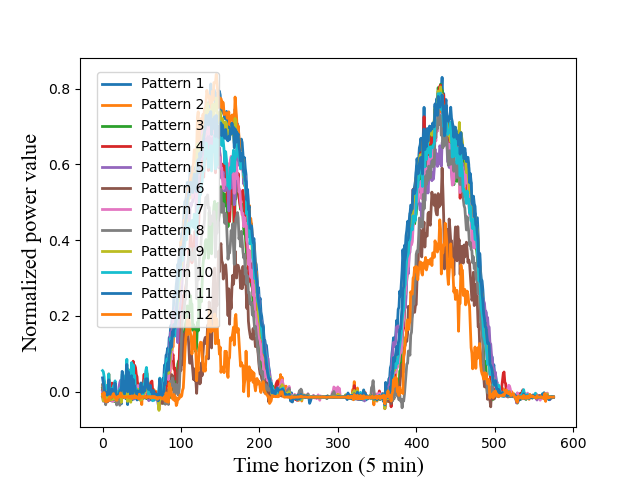

# Mixup-ACGAN-master

This repository contains the source code that implements the network described in the conference paper for SCCSI 2022:
"Controllable Photovoltaic Scenario Generation via Mixup-based Deep Generative Networks"

## Synopsis
Scenario generation is an essential method to offer a series of possible power scenarios in the future for power system planning. This paper proposes a noval method for photovoltaic (PV) scenario generation by employing interpretable condition in controllable generative adversarial networks (GANs). In order to improve the generalization performance of the network and increase the robustness to adversarial examples, a data augmentation strategy is introduced to the network. The numerical results demonstrate that, our proposed model can achieve the controllable generation of scenarios covering explicit statistical characteristics and create brand new patterns that are different from existing scenarios. 

## Language and Dependencies
To train or test the nerual network, you need installing:
* 64-bit Python 3. 7 installation,
* Tensorflow 2. 1. 0,
* Numpy 1. 19. 2.

## Pattern Visualization of PV Scenarios

## Questions?
For more questions about the code and method, please write to: wu_yi_fei0116@163.com.
